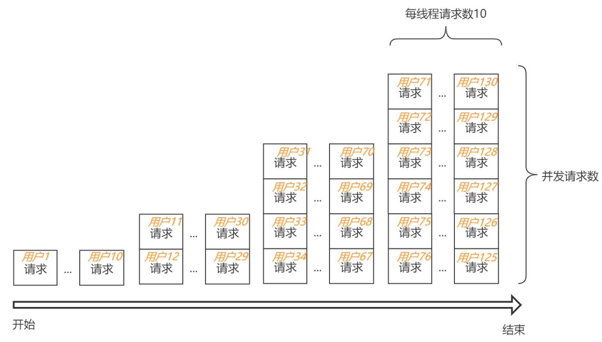

# 性能测试平台 Bomber

## 概述

### Bomber介绍

Bomber是基于 [Ironrhino](https://github.com/ironrhino/ironrhino) 和 [Bombardier](https://github.com/LightMingMing/bombardier/tree/develop-server) 实现的一个性能测试平台.

其中, Bombardier是底层执行引擎, 用于发送并发请求到目标应用, 而请求是什么样的以及并发量多少则由Bomber进行控制. 可以简单的把Bomber理解成manager, Bombardier理解成worker.

Bomber设计初衷, 是为了统一维护测试脚本, 同时借助于程序减少性能测试期间的一些重复劳动, 提升性能测试效率, 使用者只需维护好脚本, 可随时进行性能测试.

### 性能测试工具

JMeter是Apache组织基于Java开发的性能测试工具

优点:

1. 功能丰富: 断言、前置处理器、后置处理器、监听器、条件控制、内置了大量的函数等
2. 支持链路
3. 有很高的可扩展性: 比如插件支持, 存在很多比较好用的第三方插件
4. 支持GUI(客户端图形界面)

缺点:

1. 脚本不共享, 维护成本较高, 个人使用方便, 但是不太利于团队合作
2. 测试结果需要手动记录
3. 多用户场景性能测试比较麻烦, 需要使用额外的方式去生成用户文件
4. 单发模式/并发模式切换比较麻烦, 需要来回修改线程组的线程数

Bombardier是Github上一个开源的基于Go语言实现的HTTP单接口基准测试工具

优点: Go语言采用轻量级线程, 较少的内存占用, 单机可支持上万并发, 并且不会对测试机造成很高的负载

缺点: 功能比较单一, 只支持单接口测试, 不适用于多用户场景; 不支持脚本测试, 不易保证脚本的正确性; 不支持断言, 不易感知到性能测试时请求的异常执行情况.

后续个人对其进行了定制, 支持从文件中读取变量以及通过访问Bomber提供的一个API来获取变量, 以支持多用户场景

## Bomber功能特性

### 脚本(HTTP请求)集中管理

HTTP请求在前端浏览器编辑, 通过程序保存于数据库.只需部署于一台服务器, 在整个内网都可以使用, 不需要本地搭建任何环境. 像使用JMeter的话, 则需要本地安装JDK和JMeter.

### 单发模式/并发模式

单发模式主要用于HTTP请求测试, 可在前端页面上查看请求执行结果以及单次请求耗时.主要用于脚本自测, 也可辅助用于接口的功能测试


并发模式用于性能测试

### 自动记录测试结果

测试结果会在性能测试期间自动保存在数据库中, 不需要手工记录在额外的文件中.


同时借助于开源可视化工具g2实现测试结果可视化, 并支持多次测试结果的对比


### 断言

目前仅支持JsonPath断言, 可满足大多场景.

### 变量生成函数

1. CitizenIdentification 身份证号

   用于生成连续的身份证号

2. FixedLengthString 定长字符串

   可用于生成连续的手机号、银行卡号

3. 随机函数, 有如下三种

   (1) Random 随机数, 需指定最小值min, 最大值max

   (2) FixedLengthRandom 固定长度的随机数, 主要目的是使用FixedLengthRandom(length=10)代替Random(min=1,000,000,000, max=9,999,999,999)

   (3) RandomString 固定长度的随机字符串

4. SQLQuery函数

   从数据库中查询变量, 常用于条件查询, 如果多行返回**只取首行**

   eg: 根据客户身份证号, 查询客户姓名

5. SQLBatchQuery函数

   某些情况下, 需要使用数据库中已有的用户. 这时需要想办法将用户查询出来. 由于SQLQuery仅支持单行查询, 需要逐条的limit 1 offset ${count}, 这种方式查询1万个用户则会从数据库查询1万次,
   在数据库表很大时性能很低. 因此引入SQLBathQuery用于批量查询, 批量大小从1, 2, 4, 8等以2的幂次方逐渐递增(最大1024). 这种递增方式可以保证单发测试时, 只查询一行, 而在性能测试时随着查询次数增多,
   逐渐增加批量大小, 查询1万个用户只会从数据库中查询18次.

6. JavaScript脚本

   采用JDK内置的JavaScript脚本引擎实现, 由于在高版本JDK(11)被标记@Deprecated, 同时性能也没有MEVL高, 因此不推荐使用

7. MVEL脚本

   和JavaScript脚本功能类似, 性能要比JavaSript脚本高, 如下是使用JavaScript脚本引擎和MVEL脚本引擎分别进行substring的基准测试结果, MVEL性能是JavaScript的200倍.
   ```
   Benchmark                          Mode     Cnt       Score        Error  Units
   ScriptEngineBenchmark.javaScript   thrpt    3      1480.556 ±   1033.482  ops/s
   ScriptEngineBenchmark.mvel         thrpt    3    231842.882 ±  48465.141  ops/s
   ```

   eg: 使用`certId.substring(16)`脚本截取身份证号后两位

8. Login函数

   模拟用户提交表单进行登录, 生成cookie

9. OAuth2函数

   模拟用户OAuth2登录, 生成access_token

10. Count计数器

    从0开始计数, 常和`SQLQuery`配合使用

11. Properties属性函数

## 函数使用

### 函数配置


### 结果预览


### 单发测试

单发测试时, 可通过指定用户索引, 来使用不同的用户进行测试


### 性能测试


线程组: 使用不同的线程数进行压测, 获取不同并发下应用的处理能力

线程数/线程: 每个线程的请求数

起始用户索引: 用于使用不同批次的用户进行测试, 比如上次压测使用了前5000个用户, 这次则可从5000开始, 保证用户不会重复

用户作用域: 用于使用不同数量的用户进行压测; 一些查询类的场景, 使用单用户即可模拟多用户并发访问, 不需要造很多用户, 这种场景性能测试最为容易; 另外一种场景, 用户不能重复使用, 一段时间内只能访问一次

示例, 有四个线程组, 线程数分别是1, 2, 4, 6, 每线程10个请求。总的请求数为(1+2+4+6)*10=130

1. 请求：每个请求一个用户, 总的用户数为130
   
2. 线程：每个线程一个用户, 总的用户数为1+2+4+6=13
   
3. 线程组: 每个线程组一个用户, 总的用户数为4
   
4. 全局: 全局一个用户, 总的用户数为1
   